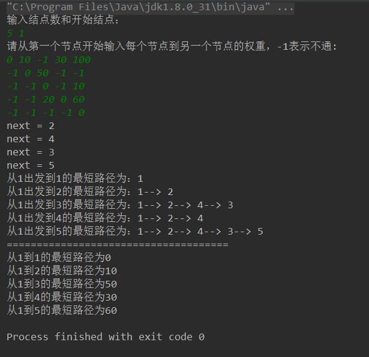

贪心算法的基本思想是找出整体中的局部的最优解，将这些局部最优解整合起来形成总的一个最优解。使用贪心算法的问题需满足下面的两个性质：

  1. 求整体的最优解可以通过求局部的最优解来解决（贪心选择性质）。
  2. 整体被划分为多个局部，这些局部具有最优解（最优子结构性质）。

Dijkstra求最短路径算法：

  1. 假设带权有向图G的顶点集合为V，起始点为V0。
  2. 初始S={V0}，T=V-S={其余顶点}，其中集合S表示已经计算出最短距离的顶点，T是还没计算的剩余顶点。
  3. 初始化V0到其余各点的距离，D(V0,Vi)代表V0到Vi的最短距离，按如下规则。
  4. 若V0可以直接到达某个顶点Vi,则将边的权值赋给(V0,Vi)，否则D(V0,Vi)=∞。
  5. 从T中选取一个与S中顶点有关联（直接相连）且权值最小的顶点W（这里用到了贪心法思想），加入到S中。
  6. 以W作为中间点，若V0到T中某个顶点Vi距离变短，则修改D(V0,Vi)的值。
  7. 重复5）和6）直到T为空。

代码：

```java
/**
 * Dijkstra 算法
 * Created by Jehu on 11/6/16.
 */
public class Dijkstra {

    private int [][]weight;
    private int start;

    public Dijkstra(int [][]weight, int start) {
        this.weight = weight;
        this.start = start;
    }

    /**
     * 开始贪心寻找最短路径
     * @return int[] 表示从start到对应顶点的最短路径长度
     */
    public int[] start() {
        int n = weight.length;//顶点数
        int []shortPath = new int[n];//存放最短路径
        String []path = new String[n];//用字符表示路径
        String thePath = "1";//最短路径
        int []visited = new int[n]; //标记是否已经找到最短路径 1表示找到，0表示未找到

        //初始化起始顶点
        shortPath[this.start] = 0;
        visited[this.start] = 1;
        path[this.start] = thePath;

        for (int i = 1; i < n; ++i) {
            int next = -1;//选出一个距离初始顶点start最近的未标记顶点,初始化为-1
            int min_path = Integer.MAX_VALUE;
            for(int j = 0; j < n; ++j) {
                if(visited[j] == 0 && weight[start][j] != -1 && weight[start][j] < min_path) {
                    min_path = weight[start][j];
                    next = j;
                }
            }
            System.out.println("next = " + (next + 1));
            //将新选出的顶点标记为已求出最短路径，且到start的最短路径就是min_path
            shortPath[next] = min_path;
            visited[next] = 1;
            thePath += "--> " + (next + 1);
            path[next] = thePath;
            //以k为中间点，修正从start到未访问各点的距离
            for(int k = 0; k < n; ++k) {
                if(visited[k] == 0 && (weight[next][k] != -1 && (weight[start][k] == -1 ||
                        weight[start][next] + weight[next][k] < weight[start][k]))){
                    weight[start][k] = weight[start][next] + weight[next][k];
                }
            }
        }
        this.print(path);
        return shortPath;
    }

    private void print(String []path) {
        for(int m = 0; m < this.weight.length; ++m) {
            System.out.println("从" + (start + 1) + "出发到" + (m + 1) + "的最短路径为：" + path[m]);
        }
        System.out.println("=====================================");
    }

}
```
测试：


```java
 import java.util.Scanner;
    
    /**
     * Test
     * Created by Jehu on 2016/11/7.
     */
    public class Test {
    
        public static void main(String []args) {
            Scanner input = new Scanner(System.in);
            System.out.println("输入结点数和开始结点：");
            int n = input.nextInt();
            int start = input.nextInt() - 1;
            int [][]weight = new int[n][n];
            System.out.println("请从第一个节点开始输入每个节点到另一个节点的权重，-1表示不通:");
            for (int i = 0; i < n; ++i) {
                for (int j = 0; j < n; ++j) {
                    weight[i][j] = input.nextInt();
                }
            }
            Dijkstra dijkstra = new Dijkstra(weight, start);
            int[] min_path = dijkstra.start();
            for (int k = 0; k < min_path.length; ++k) {
                System.out.println("从" + (start + 1) + "到" + (k + 1) + "的最短路径为" + min_path[k]);
            }
        }
    
    }
```

结果：


