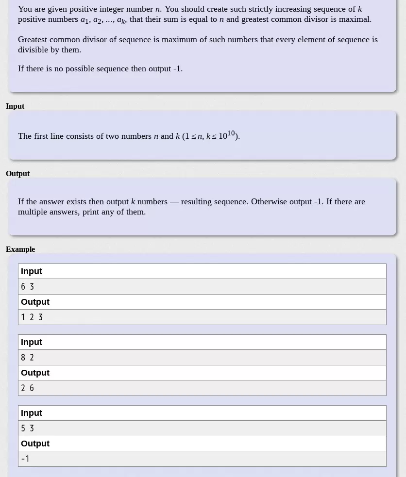

题目：


思路：

设最大的公约数为x
(a1 +  a2 + ... +  ak) * x = n
x为n的一个约束，如果求x最大，则(a1 +  a2 + ... + ak)为最小
而a1 ... ak为递增数列，所以a1 ... ak的最小值为(1 + k) * k / 2

遍历求能满足条件的最大公约数

因为 i * j = n, i和j都是n的因数，所以遍历1 -- sqrt(n)即可，下面代码中cd为最大公因数

```java
for (long i = 1; i <= sqrt; i++) {
    if (sum % i == 0) {
        if (i >= oneToK) {
            cd = sum / i;
            break;
        } else if (sum / i >= oneToK){
            cd = i;
        }
    }
}
```

找出最大公因数之后依次输出a1 * cd , a2 * cd ... a(k - 1) * cd
最后输出sum - (a1 * cd , a2 * cd ... a(k - 1) * cd)

ac代码：

```java
import java.util.Scanner;

/**
 * Code Forces
 * 803C - Maximal GCD
 * @author wu
 * Created in 下午8:43 17-9-14
 */
public class MaximalGCD {

    public static long sum;

    public static long count;

    public static long cd;

    public static long sqrt;

    public static long oneToK;

    public static void main(String[] args) {

        Scanner input = new Scanner(System.in);
        sum = Long.parseLong(input.next());
        count = Long.parseLong(input.next());
        sqrt = (long) Math.sqrt(sum);
        oneToK = (1 + count) * count / 2;
        cd = -1;

        // 千万别用oneToK > sum
        // oneToK能大到你呵呵呵
        if (count > 145000) {
            System.out.println(-1);
            System.out.println();
            return;
        }

        //求最大公因数
        for (long i = 1; i <= sqrt; i++) {
            if (sum % i == 0) {
                if (i >= oneToK) {
                    cd = sum / i;
                    break;
                } else if (sum / i >= oneToK){
                    cd = i;
                }
            }
        }

        if (cd == -1) {
            System.out.println(-1);
        } else {
            long addSum = 0;
            for (long i = 1; i < count; i++) {
                System.out.print(cd * i + " ");
                addSum += cd * i;
            }
            System.out.println(sum - addSum);
        }

        System.out.println();
    }

}
```