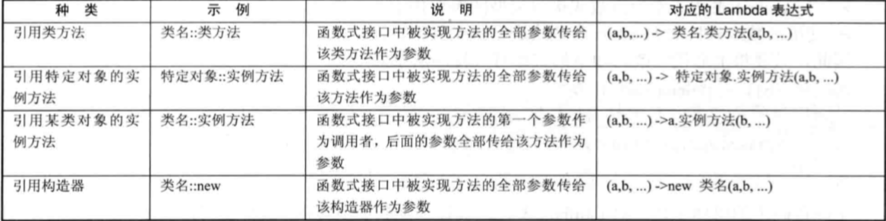

 - 空引用（null）只能转换成引用类型，不能转换成基本类型，不要把null赋值给基本数据类型变量。

 - Java堆内存是运行时数据区，存储类的实例（对象）。

 - break后跟一个标签可跳出外层循环：

        outer:
        for ( ; ; ) {
            for ( ; ; ) {
                ···
                break outer;
            }
        }

 - Java方法的参数传递方式只有一种（值传递），将实际参数值的副本（复制品）传入方法内，而参数本身不会受到任何影响。当参数为引用类型时，因传递的是引用地址，堆中并未复制出一个相同的对象，所以操作的是同一个对象。

 - 方法重载：同一个类中方法名相同，参数列表不同（两同一不同），方法返回值，修饰符与方法重载无关。

 - 定义局部变量后，系统并未为这个变量分配空间，直到为这个变量赋值，才会为局部变量分配内存。

 - 尽可能缩小局部变量作用范围，局部变量的作用范围越小它在内存里停留的时间就越短，程序运行性能越好。

 - 访问控制符protected，即可以被同一个包中其他类访问，也可以被不同包中的子类访问。

  - 静态导入使用import static语句，导入指定类的某个静态Filed、方法或全部的静态Filed、方法。

>  - 单个：`import static package.subpackage...ClassName.fieldName|methodName;`
>  - 全部：`import static package.subpackage...ClassName.*;`

  - 常量池（constant pool）专门用于管理在编译期被确定并被保存在已编译的.class文件中的一些数据。它包括了关于类、方法、接口中的常量，还包括字符串常量。

  - 对于外部类而言，其上一级为包，所以private和protected访问控制符对于外部类没有意义，外部类只能有两种访问控制级别：public和默认

  - **如果一个类要被声明为static的，只有一种情况，就是静态内部类。**

  - 接口中不允许定义静态方法，接口中的方法总是用public abstract修饰，Field总是使用public static final修饰。接口里定义的内部类、接口、枚举类都采用public static修饰。

  - 外部类以外的地方创建内部类：

> - 非静态内部类：`Out.In in = new Out().new In()`
> - 静态内部类：`Out.In in = new Out.In()`

  - 如果匿名内部类需要访问外部类的局部变量，必须使用final修饰外部类的局部变量（**Java 8之后不用不用强制添加final，如果匿名内部类访问了局部变量，该局部变量相当于自动使用final修饰**）。
  - **Java垃圾回收机制只回收内存，不会回收其他物理资源。**

 - Set集合常用实现类：HashSet, TreeSet。

 - 如果把两个相同的元素加入到同一个Set集合中，add方法会返回false，添加失败，且新元素不会被加进去。

 - Set使用equals()判断两个对象是否相同。

 - HashSet使用Hash算法存储元素，拥有很好的存取和查询功能。特点：

> ·不能保证元素排列顺序，顺序有可能改变。
> ·不是同步的，多个线程同时使用修改HashSet时，必须保证同步。
> ·元素值可以是null

 - HashSet根据元素hashCode()方法返回的hashCode值决定元素在HashSet中的存储位置。如果两个元素equals()返回true，但是两个元素hashCode()返回值不同，HashSet会将这两个元素存储在不同的位置，依然可以添加成功。

 - LinkedHashSet使用链表维护元素的添加次序，最先添加的在print(Set)时在最前面，性能相比HashSet较低，但是迭代访问Set的全部元素时有很好的性能。

 - TreeSet采用红黑树存储元素，支持自然排序和定制排序，默认情况下采用自然排序。TreeSet会调用元素的compareTo(Object obj)方法比较不同元素之间的大小关系，然后按照升序排序，这就是自然排序。如果两个对象通过compareTo(Object obj)方法比较返回0，则新对象无法添加到TreeSet中。TreeSet判断两个元素是否相等的唯一依据是两个对象通过compareTo(Object obj)方法比较是否返回0。

 - 当把一个对象添加到TreeSet中时，该对象必须实现Comparable接口。TreeSet中元素与其他元素应是同一个类的实例。

 - 当时用Comparator对象实现TreeSet的定制排序时，无需添加的元素所在类实现Comparable接口。

 - 当复制Collection集合中的所有元素来创建新的EnumSet集合时，要求Collection中的所有元素必须是同一个枚举类的枚举值。

 - HashSet和TreeSet中推荐只放入不可变对象。

 - HashSet、TreeSet、EnumSet都是线程不安全的。

 - Java 8为Iterable接口增加了forEach(Consumer consumer)方法，Iterable是Collection的父接口，所以可以使用forEach遍历Set，而Consumer是函数式接口，可以用Lambda表达式来实现遍历。
   如 ：`Collection.forEach(obj -> System.out.println("元素：" + obj));`

 - Java 8的Iterator增加了forEachRemaining(Consumer consumer)方法，所以可以使用13条所示的方法用Lambda表达式遍历Iterator。

 - List根据元素的equals()方法返回值判断两个元素是否相等。
 - List用listIterator()实现迭代，ListIterator继承了Iterator接口，增加了向前迭代的功能。
 - ArrayList封装了一个动态、允许再分配的Object[]数组，数组长度默认为10.
 - ArrayList是线程不安全的，可使用Collections工具类转换成线程安全的。
 - Queue用于模拟队列（FIFO），Deque代表一个“双端队列”，Deque的实现类既可以当队列也可以当栈使用。
 - PriorityQueue按照元素的大小对元素进行排序，自然排序需要元素实现Comparable接口，定制排序需传入一个Comparator对象。
 - Deque底层数组的长度为16。
 - 在程序中需要使用“栈”这种数据结构时推荐使用ArrayDeque或LinkedList，不推荐使用集成Vector的Stack类。
 - ArrayList、ArrayDeque内部使用数组保存元素，因此随机访问时有较好的性能；LinkedList内部以链表保存元素，随机访问性能较差，但插入、删除元素时性能非常出色。
 - 遍历List集合元素时，ArrayList使用随机访问（get()）遍历性能好；对于LinkedList集合采用迭代器（Iterator）遍历性能较好。
 - 如果需要经常执行插入、删除操作，应当使用LinkedList集合。

 - 使用Lambda表达式可以创建只有一个抽象方法的接口（函数式接口）的实例，Lamdba表达式相当于一个匿名方法。

 - Lambda由三部分组成：
> ①形参列表，允许省略形参类型，如:(param1, param2...)
> ②箭头（->）
> ③代码块，如果代码块只有一条语句可以省略花括号，如果只有一条return语句可以省略return关键字。

 - Lambda表达式的类型被称为“目标类型”，Lambda表达式的目标类型必须是“函数式接口（functional interface）”，函数式接口可以有多个默认方法，类方法，但只能有一个抽象方法。
 - 

 - HashMap根据equals()方法返回值判断两个value是否一致，通过equals()和hashCode()的返回值相等判断key是否相等。

 - WeakHashMap中的key保留了对实际对象的若引用，而WeakHashMap的key保留了对实际对象的若引用。其他方面WeakHashMap与HashMap的使用基本类似。

 - IdentityHashMap的实现跟HashMap基本相似，IdentityHashMap在判断两个key是否相等时严格按照（key1 == key2）判断。

 - Map和List关系密切，Java源码通过实现HashMap和TreeMap等集合后，包装了一个所有value为null的Map集合实现了Set集合，HashMap和TreeMap的使用可以参考HashList和TreeList。

 - HashMap为快速查询设计（HashMap底层采用数组存储key-value对），推荐使用。

  - 使用带泛型生命的接口、父类的时候不能再包含类型参数，如下会报错:
    `public Child extends Father<T> { }`
    应为类型参数传入实际类型，如下：
    `public Child extends Father<String> { }`
    或者不传入实际的类型参数：
    `public Child extends Father { }`
    不传入实际的类型参数时会将T当作Object
 - instanceof运算符之后不可以跟泛型类（如 ：... instanceof List<String>会报错），应直接跟类名（如：... instanceof List）。
 - Child是Father的一个子类型（类、接口），C是带有泛型生命的类或接口，C<Child>并不是C<Father>的子类型。泛型类的类型参数一旦被指明，该泛型类便是独立的类，与其他类无关。
 - List<?>（未知元素的List），问好（?）被称为通配符，访问List<?>类型的形参时，每个元素为Object类型。
 - 类型通配符的上限： `List<? extends Father>`，用于限制形参类型时需要将类型限制为某个父类的其他子类。
 - 类型形参的上限：`Class<T extends Father & Interface>`，用于声明泛型类时，至多有一个父类上限，但可以有多个接口上限，类上限必须放在第一个。
 - 类型通配符的下限： `List<? super Child>`

 - finally块用于回收在try块中打开的物理资源(**垃圾回收机制只会回收内存垃圾，并不会回收物理资源。**)，finally块**总会**被执行，甚至在try和catch块中执行了return，使用System.exit(1)推出虚拟机则finally块不会被执行。

 - try块执行一次，try块之后只有一个catch块会被执行。

 - try块内生命的变量是块内局部变量，只在try块内有效。

 - Error错误，一般指与虚拟机相关的问题，如系统崩溃，虚拟机错误等。这种错误无法被捕获或恢复，会导致应用程序中断。

 - 异常进入异常块后不会向下执行（即只能被一个异常块捕获）。

 - 先捕获小异常，再捕获大异常。

 - 捕获多种异常时，可用（|）将多种异常隔开，捕获多种异常时，异常变量有隐式final修饰。

 - finally块中的return、throw会使try和catch块中的return、throw失效。

 - 子方法生命抛出的异常应当是父方法声明抛出的异常类型的子类，或者相同。