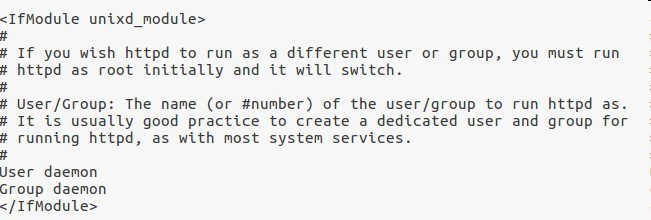

用了一段时间的Ubuntu，有些时候很不方便，需要在windows进行操作，所以为了能灵活使用两个系统达到代码共享的效果，把apache的网站根目录放到了windows的ntfs分区。但是修改完根目录之后启动apache提示403错误，没有权限，去看ntfs上文件夹的权限是777，一脸懵逼。

解决方案：

在apache的配置文件http.conf中找到

将用户和用户组daemon修改为你的用户和用户组

保存退出重启apache

问题解决

