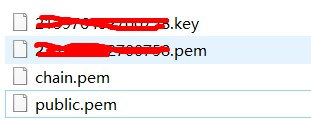

首先在阿里云官网的证书服务中购买一个免费的DV型SSL，审核通过下发之后选择apache版证书下载。
下载好的压缩包如图：

登陆服务器，进到lampp安装目录下的etc目录

mkdir ssl

之后将下载的压缩包里的文件拷到刚刚创建的ssl目录下。
进到lampp安装目录下的etc目录
vim http.conf

找到
```
#LoadModule ssl_module modules/mod_ssl.so 

#Include etc/extra/httpd-ssl.conf 

#Include etc/extra/httpd-vhosts.conf
```


这三条如果前面有#将前面的#去掉。
之后进入lampp安装目录下的etc目录的extra目录

vim httpd-ssl.conf

进行如下操作

 - 添加 SSL 协议支持语句,关闭不安全的协议和加密套件 SSLProtocol all -SSLv2 -SSLv3
 - 修改加密套件如下 SSLCipherSuite
   AESGCM:ALL:!DH:!EXPORT:!RC4:+HIGH:!MEDIUM:!LOW:!aNULL:!eNULL;
 - 将服务器证书公钥配置到该路径下 SSLCertificateFile /opt/lampp/etc/ssl/public.pem
   (证书公钥)
 - 将服务器证书私钥配置到该路径下 SSLCertificateKeyFile /opt/lampp/etc/ssl/订单号.key
   (证书私钥)
 - 将服务器证书链配置到该路径下 SSLCertificateChainFile /opt/lampp/etc/ssl/chain.pem
   (证书链)删除行首的“#”号注释符

保存退出

之后

vim httpd-vhosts.conf

进行虚拟机配置

配置样例如下：

```xml
<VirtualHost *:443>                                                           
    ServerAdmin admin                                                          
    DocumentRoot "网站根目录"                                             
    ServerName www.example.com:443                                         
    SSLEngine on                                                              
    SSLCertificateFile "/opt/lampp/etc/ssl/public.pem"             
    SSLCertificateKeyFile "/opt/lampp/etc/ssl/订单号.key"     
    SSLCertificateChainFile "/opt/lampp/etc/ssl/chain.pem"               
    ErrorLog "logs/www.example.com-error_log"                              
    CustomLog "logs/www.example.com-access_log" common                     
</VirtualHost>  
```

保存后重启apache就可以访问https://www.example.com

重启apache可能会提示apache重启失败，可以关闭服务器之后再次启动

