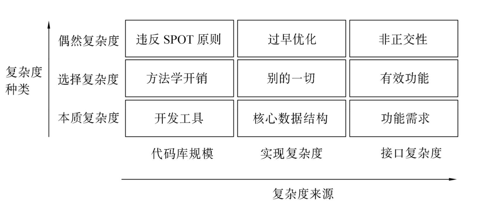

# 麻半斤
> 《Unix编程艺术》读书笔记

<!-- properties
tag: Linux
tag: 读书笔记 
created: 2023/08/30 21:59:22
-->

## 0

- **ESR实在是个美国愤青**

- 针对MacOS机器的安全攻击程序很容易编写，这个系统一直没遭到大规模攻击只是因为没人有兴趣罢了。

- 然而几年后，我们发现在 PDP-11中函数调用开销仍然昂贵，而VAX代码往往在“CALLS”指令上花费掉50%的运行时间。Dennis对我们撒了谎！但为时已晚，我们已经欲罢不能……

- 每个程序都试图扩展直到能够阅读邮件。不能如此扩展者，将被能者取代。

- 老Unix的单一品味”部分是同日本简约主义一样贫穷的结果——学会在无法获得更多条件的情况下最有效地以少量资源完成更多任务。但是 Emacs（以及在威力强大的PC机和快速网络上重新发明的新学派Unix）却是财富之子。

- 软件开发者，同其它任何类型的工匠和技师一样；他们想要成为艺术家，这并不是什么私密。

- Software is like sex—it's better when it's free. ——Linus Torvalds

## 思想

- **行程才是目的；顿悟在每日的实践中。**

- 花哨的算法在n 很小时通常很慢，而n通常很小。

- 数据压倒一切。如果已经选择了正确的数据结构并且把一切都组织得井井有条，正确的算法也就不言自明。**编程的核心是数据结构，而不是算法**。

- 以简洁为美，人人对庞大复杂的东西群起而攻之——这是一个非常看重简单解决方案的工程传统，总是设法将程序系统分解为几个能够协作的小部分，并本能地抵制任何用过多噱头来粉饰程序的企图。

- 一个程序只做一件事，并做好。程序要能协作。程序要能处理文本流，因为这是最通用的接口。

- 借助原型化找出哪些功能不必实现，有助于对性能进行优化；那些不用写的代码显然无需优化。目前，最强大的优化工具恐怕就是delete键了。我最有成效的一天就是扔掉了1000行代码。

- 要编写复杂软件又不至于一败涂地的唯一方法，就是用定义清晰的接口把若干简单模块组合起来，如此一来，多数问题只会出现在局部，那么还有希望对局部进行改进或优化，而不至于牵动全身。

- 紧凑性就是一个设计是否能装进人脑中的特性。

- 这篇文章表明，人类短期记忆能够容纳的不连续信息数就是七，加二或减二。这给了我们一个评测API紧凑性的很好的经验法则：编程者需要记忆的条目数大于七吗？如果大于七，则这个API不太可能算是严格紧凑的。

- 要达到这种简洁性，尽量不要去想一种语言或操作系统最多能做多少事情，而是尽量去想这种语言或操作系统最少能做的事情——不是带着假想行动，而是从零开始（禅称为“初心”(beginner's mind)或者叫“虚心”(empty mind)）。

- 策略（应用逻辑）应该与机制（域原语集）清晰地分离。

- OO在其取得成功的领域（GUI、仿真和图形）之所以能成功，主要原因之一可能是因为在这些领域里很难弄错类型的本体问题。例如，在GUI和图形系统中，类和可操作的可见对象之间有相当自然的映射关系。如果你发现增加的类和所显示的对象没有明显对应关系，那么很容易就会注意到胶合层太厚了。

- 禅的一个主要教导是，通常我们都透过源于欲望的偏见和成见的迷雾观察世界。要开悟，我们必须遵循禅的教导，不仅要“去欲望，少依恋”，还要“如实见”——不要让偏见和成见蒙住了眼。
- 麻半斤
  > 透明性之禅

- 软件的缺陷率和使用的语言在很大程度上无关，软件的缺陷率和使用的语言在很大程度上无关。

- 尽可能少干活；让数据塑造代码；依靠工具；把机制从策略中分离。专家级Unix程序员要学会迅速自动地看出这些可能性。建设性的懒惰是大师级程序员的基本美德之一。

- 直观并不是同易用性一样的品质，因为（正如手机的例子所示）人们可以培养出任何他们认为有关透明接口的“直观性”。虽然那种接口有着相当规模的记忆负担，然而只要基本操作是容易的，并且存在一个发现路径，允许通过简单操作让隐藏在更深角落的功能能够一次到位地触发。

- “模型”在Unix世界里通常称为“引擎”。模型包含了应用程序专用定义域的数据结构和逻辑。数据库服务器是模型的原型例子。
  > MVC中的模型

- 在一个真正分离得当的模型/视图/控制器应用程序中，视图组件由模型通知更新，并且自身作出相应反应，而不是由控制器或被显式更新请求来同步驱动。
  > MVC中的V和C

- 另一个非常有建设性的“无为”方式就是不写代码。程序性能不可能因不存在的代码而降低。而存在、但不如所设想那样高效的代码可能会降低程序的性能——但那是另一码事了。

- 但是，计算资源以及人类的思考，同财富一样，不是靠储藏而是靠消费来证明其价值的。同其它美学形式一样，我们需要注意何时设计上的简约已经不再是有价值的自律形式，而开始成为一件伪装的苦行者外衣——一种实际上把美德作为借口来敷衍工作的纵容方式。

- 选择需要管理的上下文环境，并且按照边界所允许的最小化方式构建程序。这就是“尽可能简单，而不过于简单”，集中关注选择共享上下文环境。实际上，这并不仅仅适用于框架，也适用于应用和程序系统。

- 框架是机制，尽可能少地包含策略。

- 编制或重用框架的好处之一，是能够有益于将“不这样做会是大块策略”的东西分离到独立的模块、模式或工具——可以有效地同其它程序重新组合起来的部分中去。

- 开放源码和代码重用的关系，在许多地方很像浪漫爱情和有性生殖的关系；你可以用后者的术语来解释前者，但这样做就忽略了前者的趣味。

- **先原型然后循环不断地测试和演进才是更好的方法。**

- **开源项目遵循Unix传统尽可能自动化的建议。**
  > 自动化在目前的开发过程中被严重低估

## 规则

- 调试选项的设置应该尽量不要在事后，而应该在设计之初便考虑进去。

- 总的来说，与不同操作系统相关的设计和编程风格可以追溯出三个源头：(a)操作系统设计者的意图；(b)成本和编程环境的限制对设计的均衡影响；(c)文化随机漂移，传统无非就是先入为主。

- Unix至少设立了三层内部边界来防范恶意用户或有缺陷的程序。一层是内存管理：Unix 用硬件自身的内存管理单元(MMU)来保证各自的进程不会侵入到其它进程的内存地址空间。第二层是为多用户设置的真正权限组——普通用户（非root用户）的进程未经允许，就不能更改或者读取其他用户的文件。第三层是把涉及关键安全性的功能限制在尽可能小的可信代码块上。在Unix中，即使是shell（系统命令解释器）也不是什么特权程序。

- 但是，Linux 给出“因为没安装对应的软件，所以打不开文件”这种Mac式诊断之时，就是Linux不再是Unix之日。
  > Linux面向文本的编辑

- 有一种很好的方式来验证API是否设计良好：如果试着用纯人类语言描述设计（不许摘录任何源代码），能否把事情说清楚？养成在编码前为API编写一段非正式书面描述的习惯，是一个非常好的办法。实际上，一些最有能力的开发者，一开始总是定义接口，然后编写简要注释，对其进行描述，最后才编写代码——因为编写注释的过程就阐明了代码必须达到的目的。这种描述能够帮助你组织思路，本身就是十分有用的模块说明，而且，最终你可能还想把这些说明做成路标文档(roadmap document)，方便以后的人阅读代码。

- 即最佳物理行数建议应在400至800行之间。

- 在通用编程语言中，C和Python是半紧凑的；Perl，java，Emacs Lisp，和shell则不是（尤其是严格的shell编程，要求你必须知道其他六个工具，如sed(1)和awk(1)等）。C++是反紧凑性的——该语言的设计者已经承认，他根本不指望有哪个程序员能够完全理解C++。

- 在Unix中，对字段值可能包含空格的DSV格式，冒号是默认的分隔符。

- Unix开发者对 GUI 界面比较冷淡的原因之一是，在设计者仓促完成的每个看起来 “用户友好”的GUI界面中，都令必须解决用户问题的人感到无从下手而非常沮丧——或者，确切地说，在设计者预想的狭窄范围以外，与界面的交互令人感到相当不透明。

- 管道线中所有阶段的程序是并发运行的，注意到这一点很重要。

- 迄今我们已经讨论的各种通讯方法都存在隐含的层次关系，即一个程序实际上控制或驱动另一个程序，而在反方向却没有或仅有有限的反馈。

- 支持RPC的常见理由是它比文本流方法允许“更丰富”的接口——也就是说，接口可以具有更复杂、更专用的数据类型本体。但是想想简洁原则吧！

- 使用经典的RPC太容易用复杂晦涩的方式完成任务，而不是保持其简单。RPC似乎鼓励生产规模庞大、结构复杂、过度行工的系统，加上令人糊涂的接口、居高不下的全局复杂度、严重的版本不兼容和可靠性问题——简直就是厚胶合层为非作歹的完美实例。

- 把线程、远程过程调用接口和重量级的面向对象设计结合使用特别危险。如果使用地非常谨慎和优雅，这些技术中的任何一个技术可能都非常有价值——但是如果你被邀请加入要使用这三者的项目，逃之夭夭并不丢面子。

- 微型语言的优势之一是可以把一些自顶向下的决策放到微型语言的程序控制流中，从而帮助我们从自底向上的编程中得到一个良好的设计。但如果我们对微型语言设计的本身采取自底向上的方法，则最终我们很可能得到一种丑陋的语法，反映出一种薄弱的语言和未经仔细考虑的实现。

- 总的规则就是，文件的解释不应该被人眼不能分辨的区别所干扰。
  > 控制文件不要区别隐匿的空白符

- 偶然复杂度的产生是因为没有找到实现规定功能集合的最简方法。偶然复杂度可以由良好的设计或重新设计来去除。另一方面，选择复杂度，同某个期望的功能相关联，只能由改变工程的目标来去除。

- 

- 只有实证了其它方法行不通时才写庞大程序———也就是，已经尝试过分解问题但遭到失败。格言表明了对待庞大程序的一种严谨怀疑态度以及一种谨慎的策略方法：首先寻找小巧程序的解决方案。如果单个小程序无法完成这项工作，尝试在现有框架结构内构造一个协作小程序工具包来解决问题。如果两者都失败了，才可以自由地构建一个巨型程序（或一个新框架），而不会觉得已经完败于设计挑战。

- **在现代条件下，也许最好把C视作适用Unix虚拟机的高级汇编器**。

- **如果一个应用程序按接口文档得到一个非预期的结果，那么不是违反了规格，就是发现了bug。**

- 优先从流、命名空间、进程等Unix基本抽象中得到更多效用，而不是增加新的东西。

- 某种角度上，Unix世界的模型完全是静态的。程序的运行总被设想为暂时的，所以文件和目录环境在整个执行中都可以当成静态的。如果某个指定的文件或目录发生了改变，没有标准的、良好的方式来让系统通知应用程序。当编写长期运行的用户界面软件，如果又希望知道环境的改变时，这就会成为重大的问题。

## 方法

- 他从不提交冗长的规格说明，而是把一些shell脚本和awk代码结合在一起，使其基本能够完成所需要的任务，然后告诉客户派几个职员来使用这些原型，问他们是否喜欢。如果喜欢，他就会说“在多少多少个月之后，花多少多少的钱就可以获得一个商业版本”。

- 对于大多数黑客和几乎所有的非黑客而言，“用自由软件是因为它运行得更好”轻而易举地盖过了“用自由软件是因为所有软件都该是自由的”。

- 将服务器操作系统特性，如多用户优先权组和完全多任务处理，改装到客户端操作系统上非常困难，很可能打破对旧版本客户端的兼容性，而且通常做出的系统既脆弱又令人不满意，不稳定也不安全。

- 如果设计者意识到胶合层的存在，并试图围绕自身的一套数据结构或对象把胶合层组织成一个中间层，结果却导致出现两个胶合层——一个在中间层之上，另一个在中间层之下。那些天资聪慧但经验不足的程序员特别容易掉进这种陷阱；他们将每种类别（应用逻辑、中间层和域原语集）的基本集都做得很好，就像教科书上的例子一样漂亮，结果却因为整合这些漂亮代码所需的多个胶合层越来越厚，而最终在其中苦苦挣扎。

- Roguelike模式在迎合这种偏爱的同时，也支持了 ed 模式无法提供的类 GUI 元素的直接操作。这样，rougelike接口设计模式丝毫没继承两个世界的糟粕，反而是吸收了最精华的部分。

- 通常，老是告诉用户他们已经知道的事情是非常糟糕的风格（“程序<foo>正在启动…”，或是“程序<foo>正在退出”就是两个经典违例）。接口设计作为整体应该遵从最小立异原则，但是信息内容应该符合最大惊奇原则——仅仅对偏离通常期望的情况详加说明。

- 所以我们有一个有趣的悖论。随着机器资源成本的直线下降，庞大数据结构的平均开销也随之而降——但是因为相邻级别缓存的切换开销上升了，大型结构突破缓存容量对性能的影响也就增加了。因此在这里，“小即是美”的建议比以往更有用，尤其是考虑到核心数据结构必须留在最快的缓存里。该建议也同样适用于代码；通常，指令加载要比执行花费的时间更多。

- 使用脚本语言的性能损失对真实世界的程序来说经常微不足道，因为真实世界的程序往往受I/O事件等待、网络延迟以及缓存列填充等限制，而非CPU的自身效率。

- C的内存管理是复杂性和错误的渊薮。对于处理复杂数据结构的程序而言，有研究（据[Boehm]称）估计30%～40%的开发时间都用于存储管理。这个估计甚至还没有包括对调试成本的影响。尽管缺乏确凿坚实的数据，但很多经验丰富的程序员都相信，内存管理产生的bug是真实代码持续产生错误的最大单体来源。缓冲溢出是产生崩溃和安全漏洞的常见原因。动态内存管理造成诸如内存泄漏、指针失效问题等阴险、难以跟踪的bug，特别臭名昭著。

- 为了shell作为交互式命令行解释器的实用性，而在设计中对语言部分做了折中，这些缺点就是这么来的。

- shell 的最佳之处在于书写小型脚本非常自然快捷。最糟之处在于大型 shell脚本必须依靠大量辅助命令，而这些辅助命令不一定在所有目标机器上都表现一致甚至不一定存在。要在大型shell脚本中分析依赖关系并不容易。

- 但在Unix的基础设计概念集上真正所加的全新的概念只有一个（私有命名空间）。
  > 容器化的基础起源