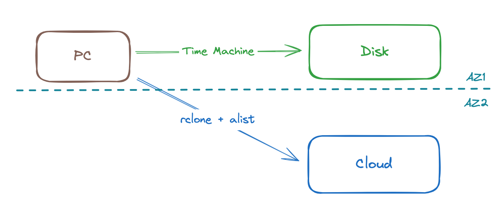
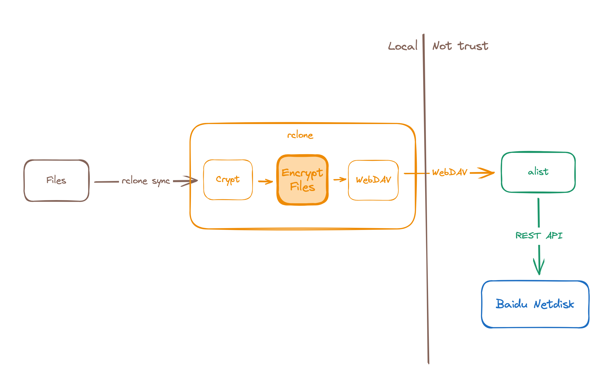

# Back up with rclone and alist

<!-- properties
language: en
tag: Solution
created: 2024-04-10 20:54:18
-->

I share an interesting story in ***Just For Fun*** about back up, I use TimeMachine to back up on a disk finally after trying to back up on NUC. But it can't satisfy 3-2-1 backup strategy, recently I solve this problem with [rclone](https://rclone.org/) and [alist](https://alist.nn.ci/).

> 3-2-1 backup strategy: 3 copies, 2 media, 1 offsite.



First I convert Baidu Netdisk service to WebDAV through alist, then connect to WebDAV with rclone. I also create a crypt configuration on rclone to encrypt file, and finally use ```rclone sync``` to incrementally synchronize files to Baidu Netdisk.



Rclone is a terminal command, so I modify sync script in [Homelab](https://github.com/coder-wu/homelab), synchronize by rclone. I run alist service in container, and I also add alist k8s yaml files in [Homelab](https://github.com/coder-wu/homelab).