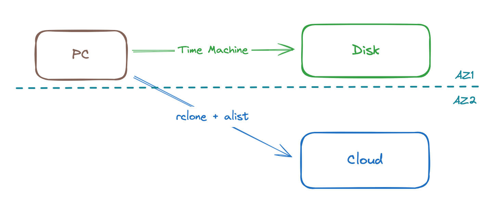
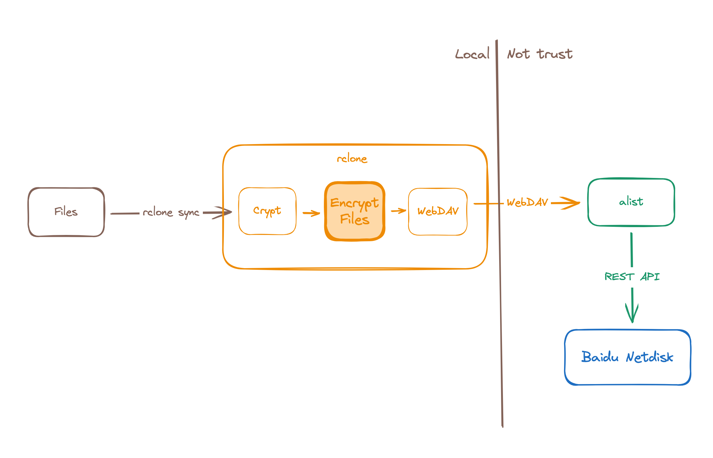

# 使用rclone和alist实现云端备份

<!-- properties
tag: Solution
created: 2024-04-10 20:54:18
-->

在「瞎折腾」里写了用NUC折腾备份的事情，折腾到最后还是用TimeMachine来备份到磁盘。不过这样的备份无法满足3-2-1的备份策略，最近通过[rclone](https://rclone.org/) + [alist](https://alist.nn.ci/)完善了备份方案。

> 3-2-1备份策略：3份副本，2种介质，1个异地。



首先通过alist将百度云盘转换为WebDAV，接着通过rclone对接WebDAV，再在rclone上配置crypt实现文件加密，最终使用```rclone sync```将文件增量同步到云端。



rclone以command的形式提供，因此修改了[Homelab](https://github.com/coder-wu/homelab)中的sync脚本，通过rclone实现同步。也在[Homelab](https://github.com/coder-wu/homelab)中添加了alist的k8s配置，通过容器运行alist服务。