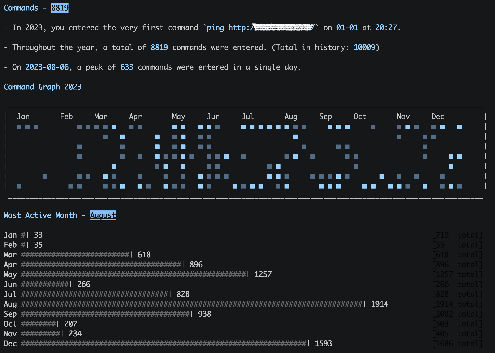

# 💻 Command 2023

<!-- properties
tag: Linux
created:  2024-01-07 18:30:13
-->

报告通过 🔧 [cmd-wrapped](https://github.com/YiNNx/cmd-wrapped)生成。

> Report is generated by 🔧 [cmd-wrapped](https://github.com/YiNNx/cmd-wrapped).

