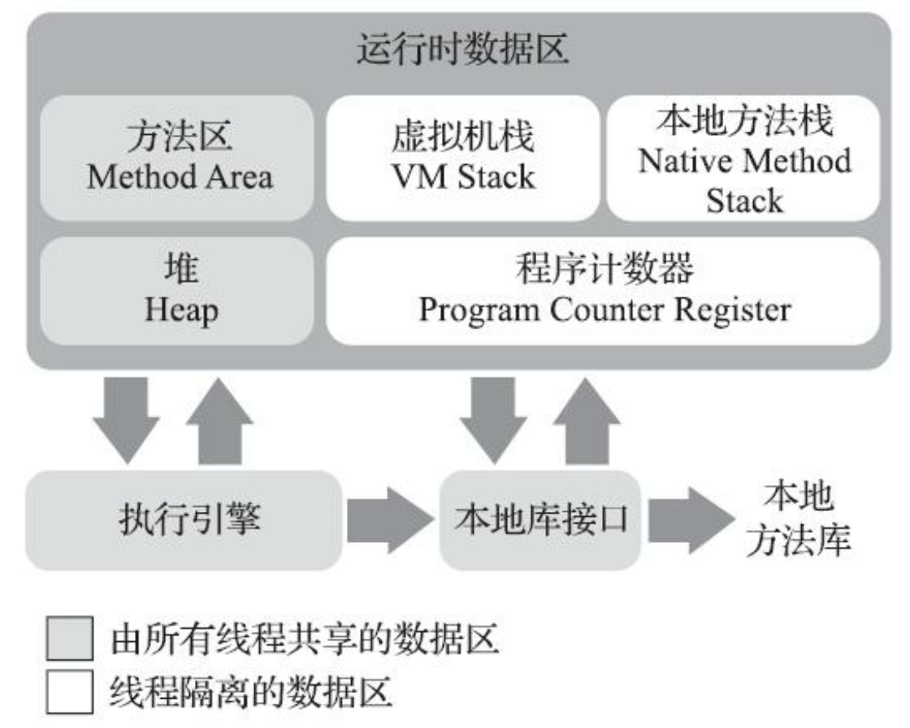
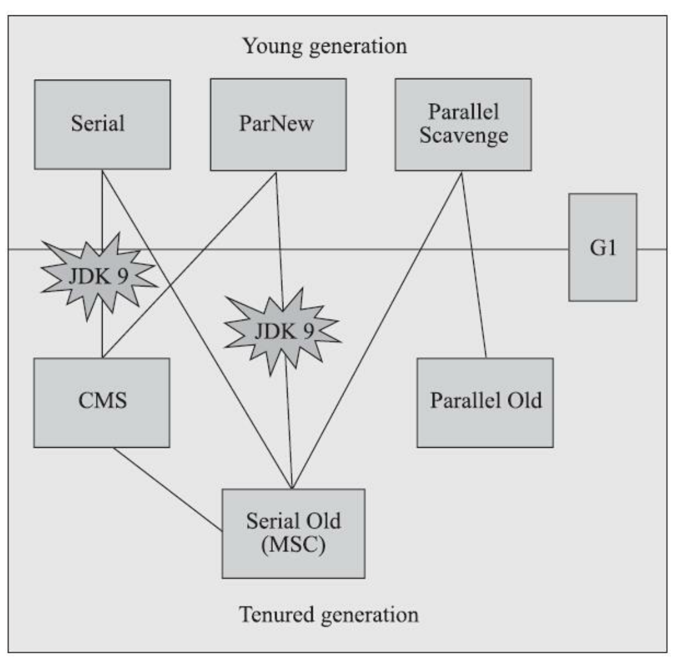
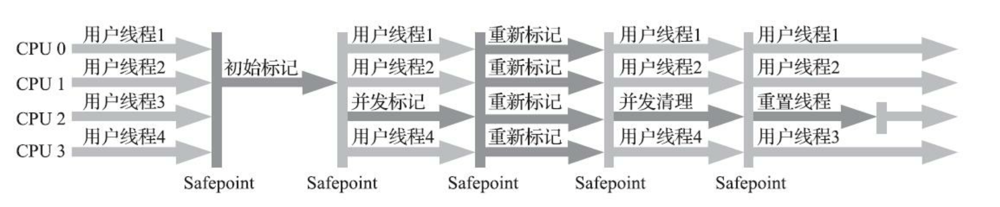
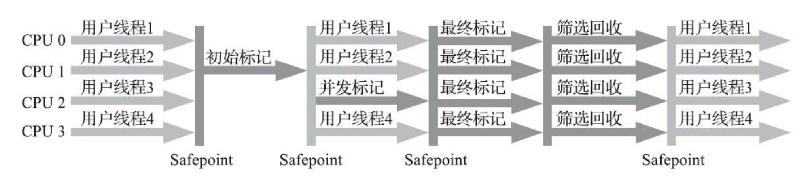
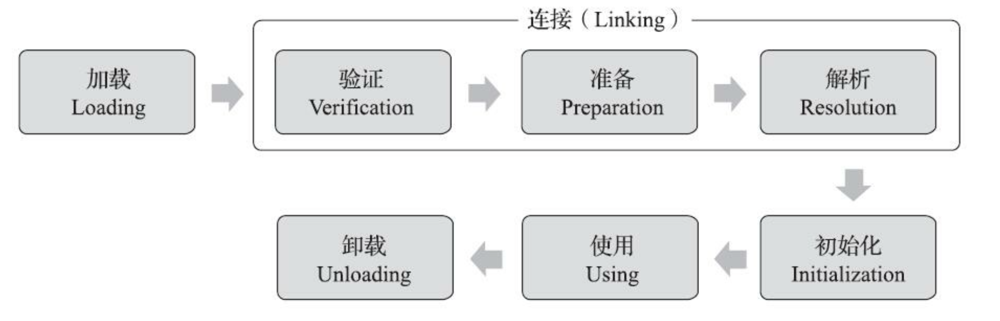

# 深入理解Java虚拟机

<!-- properties
tag: Java
tag: 读书笔记 
created:  2023/04/22 13:29:30
-->

## Java运行时区域

### 程序计数器

- 程序计数器(Program Counter Register)是一块较小的内存空间，它可以看作是当前线程所执行的字节码的行号指示器。
- 各条线程之间计数器互不影响，独立存储。  
- 是唯一没有规定任何OutOfMemoryError情况的区域。  

### Java虚拟机栈/本地方法栈

- 如果线程请求的栈深度大于虚拟机所允许的深度，将抛出StackOverflowError异常。
- 每个进程可用最大内存受操作系统控制，进程最大内存 - 堆最大内存 - 方法区最大内存 剩余的内存就是栈可用内存，当栈扩展时无法申请到足够的内存会抛出OutOfMemoryError异常。

### 堆

- “几乎”所有的对象实例都在这里分配内存。**栈上分配、标量替换使得对象可以在栈上分配。**

### 方法区

- 方法区(Method Area)与Java堆一样，是各个线程共享的内存区域，它用于存储已被虚拟机加载的类型信息、常量、静态变量、即时编译器编译后的代码缓存等数据。
- 到了JDK 8，全部移到元空间中。
- 这区域的内存回收目标主要是针对常量池的回收和对类型的卸载。
- 在大量使用反射、动态代理、CGLib等字节码框架，动态生成JSP以及OSGi这类频繁自定义类加载器的场景中，通常都需要Java虚拟机具备类型卸载的能力，以保证不会对方法区造成过大的内存压力。

### 运行时常量池

- 运行时常量池(Runtime Constant Pool)是方法区的一部分。Class文件中除了有类的版本、字段、方法、接口等描述信息外，还有一项信息是常量池表(Constant Pool Table)，用于存放编译期生成的各种字面量与符号引用，这部分内容将在类加载后存放到方法区的运行时常量池中。

## 内存分配

- 对象优先在Eden分配
- 大对象直接进入老年代
- 长期存活的对象将进入老年代
- 动态对象年龄判定
- 空间分配担保
  - 只要老年代的连续空间大于新生代对象总大小或者历次晋升的平均大小，就会进行Minor GC，否则将进行Full GC。

## 垃圾回收

### 对象生死

- 引用计数法，循环引用等特殊场景需要额外处理。
- 可达性分析，JVM采用这种算法。从“GC Roots”的根对象作为起始节点集，根据引用关系向下搜索，如果某个对象到GC Roots间没有任何引用链，证明此对象是不可能再被使用的。

- 强引用
- 软引用 系统将要发生内存溢出异常前
- 弱引用 生存到下一次垃圾收集发生为止
- 虚引用 一个对象是否有虚引用的存在，完全不会对其生存时间构成影响，也无法通过虚引用来取得一个对象实例。为一个对象设置虚引用关联的唯一目的只是为了能在这个对象被收集器回收时收到一个系统通知。

### 垃圾回收算法

#### 分代收集

- 绝大多数对象都是朝生夕灭的
- 熬过越多次垃圾收集过程的对象就越难以消亡

#### 标记-清除

- 内存空间碎片化
- CMS收集器

#### 标记-复制

- 可用内存缩小为原来的一半
- ParNew新生代收集器

#### 标记-整理

- 会Stop The World
- Parallel Scavenge

#### Hotspot实现

- 根节点枚举，安全点/安全区域轮询，主动式中断。
- 卡表(Card Table)的方式实现记忆集，记录跨代引用。
  - 只要卡页内有一个(或更多)对象的字段存在着跨代指针，对应卡表标识为1，变脏(Dirty)。在垃圾收集发生时把包含跨代指针卡页加入GC Roots中一并扫描。
  - 写后屏障更新卡表
- 并发的可达性分析，解决用户线程与收集器是并发修改问题：
  - 增量更新 CMS
  - 原是快照 G1

### 垃圾收集器

#### Parallel Scavenge收集器

- Parallel Scavenge基于标记-复制算法实现的新生代收集器。
- 关注吞吐量。
- 自适应的调节策略。
- MaxGCPauseMillis参数，更关注最大停顿时间。
- GCTimeRatio，更关注吞吐量。

#### CMS

- 浮动垃圾 Serial-Old托底。

#### G1

- 不再分代，分为多个大小相等的独立区域(Region)。
- 根据允许的收集停顿时间，优先处理回收价值收益最大的那些Region。
- 每个Region维护自己的记忆集，耗费大约相当于Java堆容量10%至20%的额外内存。
- G1整体基于“标记-整理”，局部(两个Region 之间)基于“标记-复制”算法实现。
- 内存占用(Footprint)、额外执行负载 (Overload)都要比CMS要高。

**从G1开始，最先进的垃圾收集器的设计导向都不约而同地变为追求能够应付应用的内存分配速率 (Allocation Rate)，而不追求一次把整个Java堆全部清理干净。**

#### ZGC

- 基于Region内存布局的，(暂时) 不设分代的，分配效率不会太高。
- 读屏障、染色指针和内存多重映射等技术来实现可并发的标记-整理算法的。
- 低延迟。

并发标记 -> 并发预备重分配 -> 并发重分配 -> 并发重映射

## 类文件结构

- Java虚拟机不与包括Java语言在内的任何程序语言绑定，它只与“Class文件”这种特定的二进制文件格式所关联。
- 一个Class文件对应着一个类或接口的定义信息，类或接口并不一定都得定义在文件里，譬如类或接口也可以动态生成，直接送入类加载器中。
- Class文件只有两种数据类型:“无符号数”和“表”。
- 无符号数属于基本的数据类型，以u1、u2、u4、u8来分别代表1个字节、2个字节、4个字节和8个字节的无符号数，无符号数可以用来描述数字、索引引用、数量值或者按照UTF-8编码构成字符串值。 
  - Java 8种基本类型：
    - u1 boolean, byte
    - u2 char, short
    - u4 int, float
    - u8 long, double
- 常量池中主要存放两大类常量:字面量(Literal)和符号引用(Symbolic References)。
  - 字面量，如文本字符串、被声明为final的常量值等。
  - 符号引用:
    - 被模块导出或者开放的包(Package)
    - 类和接口的全限定名(Fully Qualified Name)
    - 字段的名称和描述符(Descriptor)
    - 方法的名称和描述符
    - 方法句柄和方法类型(Method Handle、Method Type、Invoke Dynamic) 
    - 动态调用点和动态常量(Dynamically-Computed Call Site、Dynamically-Computed Constant)

- Java虚拟机内置的JVMTI接口只能修改已有方法的方法体，而不能添加新成员、删除已有成员、修改已有成员的签名等。

## 类加载机制

- 先触发其父类的初始化。
- 当一个接口中定义了JDK 8新加入的默认方法(被default关键字修饰的接口方法)时，如果有 这个接口的实现类发生了初始化，那该接口要在其之前被初始化。
- 数组是由虚拟机自动生成的、直接继承于java.lang.Object的子类，应有的属性和方法(用户可直接使用的只有被修饰为public的length属性和clone()方法)都实现在这个类里。
- 准备阶段是正式为类中定义的变量(即静态变量，被static修饰的变量)分配内存并设置类变量初始值的阶段。
- 解析阶段是Java虚拟机将常量池内的符号引用替换为直接引用的过程。

- 字段解析
  - 本身 -> 从下往上递归搜索接口 -> 从下往上递归搜索其父类 -> java.lang.NoSuchFieldError异常

- 方法解析
  - 本身 -> 父类中递归查找 -> 递归查找接口，抛出java.lang.AbstractMethodError -> java.lang.NoSuchMethodError

- <clinit>()方法是由编译器自动收集类中的所有类变量的赋值动作和静态语句块(static{}块)中的语句合并产生的，编译器收集的顺序是由语句在源文件中出现的顺序决定的，静态语句块中只能访问到定义在静态语句块之前的变量，定义在它之后的变量，在前面的静态语句块可以赋值，但是不能访问。

- Java虚拟机保证一个类的<clinit>()方法在多线程环境中被正确地加锁同步，如果多个线程同时去初始化一个类，那么只会有其中一个线程去执行这个类的<clinit>()方法。
  - **静态内部类实现单例模式**

- 双亲委派模型要求除了顶层的启动类加载器外，其余的类加载器都应有自己的父类加载器。不过这里类加载器之间的父子关系一般不是以继承(Inheritance)的关系来实现的，而是通常使用组合(Composition)关系来复用父加载器的代码。

## 方法调用

- 静态方法、私有方法、实例构造器、父类方法、被final修饰的方法在类加载的时候把符号引用解析为该方法的直接引用。

- Overload 静态多分派，根据方法签名信息、和**静态类型**选择对应方法，在编译期确定写入class文件。

- Override 动态单分派，根据**运行时实际类型**按照继承关系从下往上依次搜索父类。

- Reflection是在模拟Java代码层次的方法调用，重量级，只支持Java。

- 而MethodHandle是在模拟字节码层次的方法调用，轻量级，可支持运行在JVM上的其他语言。

## 编译优化

### 编译期优化

- 常量折叠，常量计算式转换成计算结果。
- final，修饰的局部变量和普通局部变量在class文件中没有区别，编译期检查。
- 编译后的字节码文件中，全部泛型都被替换为原来的裸类型，并且在相应的地方插入了强制转型代码，向前兼容低版本Java。
- 不支持int、long与Object之间的强制转型，所以引入装、拆箱。

- 生成字节码阶段会如把字符串的加操作替换为StringBuffer或StringBuilder(取决于目标代码的版本是否大于或等于JDK 5)的append()操作。

- 遍历循环则是把代码还原成了迭代器的实现，这也是为何遍历循环需要被遍历的类实现Iterable接口的原因。

### 运行时优化

- 逃逸分析
  - 栈上分配
  - 标量替换
  - 同步消除

## 并发

- 由于volatile变量只能保证可见性，在不符合以下两条规则的运算场景中，我们仍然要通过加锁 (使用synchronized、java.util.concurrent中的锁或原子类)来保证原子性: 
  - 运算结果并不依赖变量的当前值，或者能够确保只有单一的线程修改变量的值。 ——变量本身不能参与运算。
  - 变量不需要与其他的状态变量共同参与不变约束。 ——不能有其他操作依赖于该值。

- 原子性
- 可见性
- 有序性

- 实现线程安全
  - 互斥同步 synchronized，ReentrantLock与synchronized相比:等待可中断、公平锁及锁可以绑定多个条件。
  - 非阻塞同步 Compare-and-Swap，CAS。

- 锁优化
  - 自旋锁与自适应自旋
  - 锁消除，依据来源于逃逸分析的数据支持。
  - 轻量级锁
  - 偏向锁
  

## 总结

### 对象的创建

- 当Java虚拟机遇到一条字节码new指令时，首先将去检查这个指令的参数是否能在常量池中定位到一个类的符号引用，并且检查这个符号引用代表的类是否已被加载、解析和初始化过。
- 如果没有，那必须先执行相应的类加载过程：加载 -> 验证 -> 准备 -> 解析 -> 初始化 -> 使用 -> 卸载
- 类加载检查通过后，接下来虚拟机将为新生对象分配内存。
- 内存分配完成后Java虚拟机还要对对象进行必要的设置，例如这个对象是哪个类的实例、如何才能找到类的元数据信息、对象的哈希码(实际上对象的哈希码会延后到真正调用Object::hashCode()方法时才计算)、对象的GC分代年龄等信息。这些信息存放在对象的对象头(Object Header)之中。
- 构造函数，即Class文件中的<init>()方法还没有执行，所有的字段都为默认的零值，对象需要的其他资源和状态信息也还没有按照预定的意图构造好。一般来说(由字节码流中new指令后面是否跟随invokespecial指令所决定，Java编译器会在遇到new关键字的地方同时生成 这两条字节码指令，但如果直接通过其他方式产生的则不一定如此)，new指令之后会接着执行<init>()方法，按照程序员的意愿对对象进行初始化，这样一个真正可用的对象才算完全被构造出来。

### Override & Overload

- 相同的简单名称，不同的特征签名，特征签名是指一个方法中各个参数在常量池中的字段符号引用的集合，返回值不包含在特征签名之中。Class文件中描述符（带返回值）不同的方法可以同时存在，**所以在编译期间控制特征签名不一样。**
- Overload 静态多分派，根据方法签名信息、和**静态类型**选择对应方法，在编译期确定写入class文件。
- Override 动态单分派，根据**运行时实际类型**按照继承关系从下往上依次搜索父类。

## 思考

- JVM as VM？