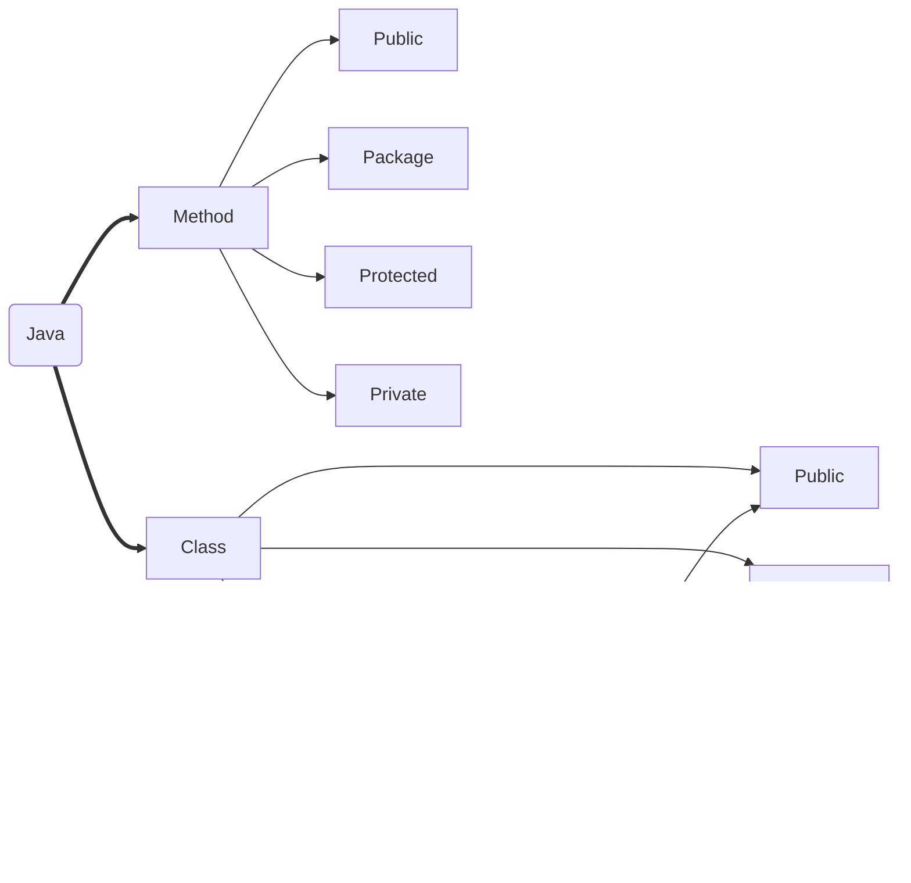

# Java地图

<!-- properties
tag: Java
tag: 脑图
created: 2023-09-01 23:12:18
-->

```mermaid
graph LR

Java(Java)

Java ==> Method
Method --> M-Public[Public]
Method --> M-Package[Package]
Method --> M-Protected[Protected]
Method --> M-Private[Private]

Java ==> Class -..-> InnerClass[Inner Class]
Class --> Public
Class --> Package

InnerClass --> Public
InnerClass --> Package
InnerClass --> Protected
InnerClass --> Private
```
