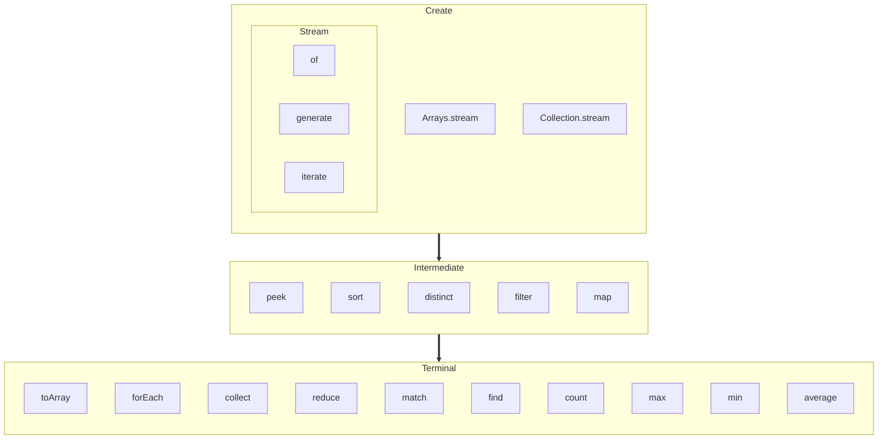
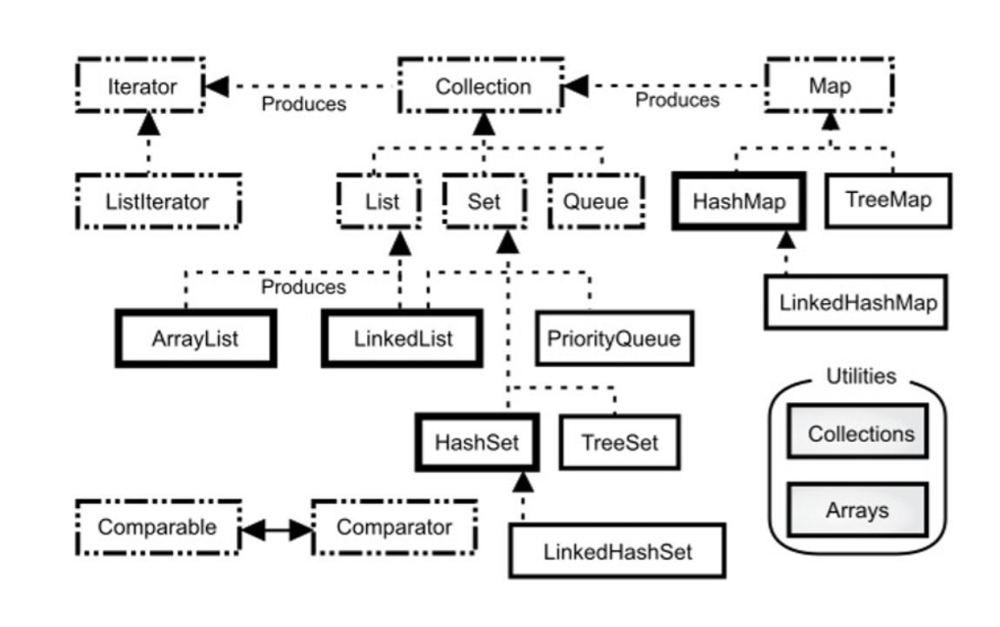

# On Java 8

<!-- properties
tag: Java
tag: 读书笔记 
created: 2023/05/10 20:51:09
-->

## OO

- 在“问题空间”（问题实际存在的地方）的元素与“方案空间”（对实际问题进行建模的地方，如计算机）的元素之间建立理想的“一对一”的映射关系。

- Java不需要sizeof()方法获取数据项被分配的字节大小，因为所有类型的大小在不同平台上是相同的。 —— Java本身就是一种“与平台无关”的语言。

## 控制符 

- 移位运算符 `>>` 有“正”、“负”值：若值为正，则在高位插入 0；若值为负，则在高位插入 1。

- Java也添加了一种“不分正负”的移位运算符（>>>），它使用了“零扩展”（zero extension）：无论正负，都在高位插入0。

## 流程控制 

- case语句能够堆叠在一起，为一段代码形成多重匹配，即只要符合多种条件中的一种，就执行那段特别的代码，如下写法：

```java
Random rand = new Random(47);
for(int i = 0; i < 100; i++) {
  int c = rand.nextInt(26) + 'a';
  System.out.print((char)c + ", " + c + ": ");
  switch(c) {
    case 'a':
    case 'e':
    case 'i':
    case 'o':
    case 'u': System.out.println("vowel");
              break;
    case 'y':
    case 'w': System.out.println("Sometimes vowel");
              break;
    default:  System.out.println("consonant");
  }
}
```

## Class & Abstract Class & Interface

- 如果不需要内部类对象与其外部类对象之间有联系，那么可以将内部类声明为static，这通常称为嵌套类。想要理解static应用于内部类时的含义，就必须记住，普通的内部类对象隐式地保存了一个引用，指向创建它的外部类对象。然而，当内部类是static的时，就不是这样了。嵌套类意味着:
  - 1. 要创建嵌套类的对象，并不需要其外部类的对象。
  - 2. 不能从嵌套类的对象中访问非静态的外部类对象。

- static方法中不会存在this。不能在静态方法中调用非静态方法（反之可以）。

- 可变参数列表会被转变为数组。

- 可变参数列表不依赖于自动装箱，而使用的是基本类型。

- 带参数的构造函数：对基类构造函数的调用必须是派生类构造函数中的第一个操作。如果你写错了，编译器会提醒你。

- 无参构造函数：默认从基类 “向外” 调用无参构造函数，如果没有无参构造函数，编译器也会为你合成一个无参数构造函数，调用基类构造函数。

- 有可能的话，尽量不要调用类中的任何方法。在基类的构造器中能安全调用的只有基类的final方法(这也适用于可被看作是final的private方法)。

- 接口的典型使用是代表一个类的类型或一个形容词，如Runnable或Serializable，而抽象类通常是类层次结构的一部分或一件事物的类型，如String或 ActionHero。

- 为什么接口中的字段是static final的？final确保了不变性，static确保了所有接口公用。

- 内部类只能通过外部类的具体对象创建。

### Override

- private方法默认带有final属性，无法被重写，如果加上@Override会在编译期报错。

- 属性与静态方法不存在多态和Override，只和运行时类型有关。

- Java5中引入了协变返回类型，这表示派生类的被重写方法可以返回基类方法返回类型的派生类型。


### Overload

- 为什么不能根据返回值重载：调用一个方法且忽略返回值，Java编译器就不知道你想调用哪个方法。

- 使用不同范型重载时，因为擦除，所以重载方法产生了相同的类型签名。因而，当擦除后的参数不能产生唯一的参数列表时，必须提供不同的方法名。

## 访问权限 

- protected也提供包访问权限

- final
  - 防止子类通过覆写改变方法的行为。
  - 在早期的Java实现中，如果将一个方法指明为final，就是同意编译器把对该方法的调用转化为内嵌调用。

- 类的访问权限可以是package或者public，但是内部类可以是private或者protected的。

## Functional & Lambda

- OO(object oriented，面向对象)是抽象数据，FP(functional programming，函数式编程)是抽象行为。

- “不可变对象和无副作用” 范式，函数式语言作为并行编程的解决方案。

- Java 8让函数式编程更简单，不过我们要确保一切是final的，同时你的所有方法和函数没有副作用。

- 通过传入所有方法都适用的 Consumer 来避免重复代码。
  ```java
  static void test(String testName, Consumer<Optional<String>> cos) {
      System.out.println(" === " + testName + " === ");
      cos.accept(...);
  }
  ```
- 我们不能通过传递null到of()来创建Optional对象。最安全的方法是，使用ofNullable()来优雅地处理null。



## 集合

- 优先选择集合而不是数组。



## 范型

- 擦除的核心动机是你可以在泛化的客户端上使用非泛型的类库，反之亦然。

- 擦除边界就是动作发生的地方
  > get和set动作发生的地方，编译器编译时处理。

## 并发/并行

- C: 客户端执行操作的线程数量  
  P: 并行算法使用的并行数量  
  N: 数组的大小: **10ˆ(2*k)，通常来说，k=1..7**足够来练习不同的缓存占用。  
  Q: setter的操作成本  
  这个C/P/N/Q模型在早期JDK8的Lambda开发期间浮出水面，大多数并行的Stream操作(parallelSetAll()也基本相似)都满足这些结论:**N*Q**(主要工作量)对于并发性能尤为重要。并行算法在工作量较少时可能实际运行得更慢。  
  在一些情况下操作竞争如此激烈使得并行毫无帮助，而不管N*Q有多大。当C很大时，P就变得不太相关(内部并行在大量的外部并行面前显得多余)。此外，在一些情况下并行分解会让相同的C个客户端运行得比它们顺序运行代码更慢。  

- 使用并发的的主要问题是阻塞。

- 线程上下文切换的开销在单个处理器上可能会影响多线程执行效率。

## 注解

- 使用xml时一个类有多处配置，这经常导致代码的同步问题。使用注解可以避免。

- 使用注解时如果需要修改本可以在xml中配置的数据需要重新编译，设计生产场景时会不方便。

## 异常

- 只是在当前的环境中还没有足够的信息来解决这个问题，所以就把这个问题提交到一个更高级别的环境中，在那里将作出正确的决定。

- 把异常情形与普通问题相区分很重要，所谓的普通问题是指，在当前环境下能得到足够的信息，总能处理这个错误。
  > 普通问题不需要定义和抛出异常

- 如果只是把当前异常对象重新抛出，那么printStackTrace()方法显示的将是原来异常抛出点的调用栈信息，而并非重新抛出点的信息。要想更新这个信息，可以调用fillInStackTrace()方法，这将返回一个Throwable对象，它是通过把当前调用栈信息填入原来那个异常对象而建立的。
  > 如果不通过fillInStackTrace，直接通过printStackTrace不方便定位是在哪里调用的发生异常的代码。

- 当涉及break和continue语句的时候，finally子句也会得到执行。请注意，如果把finally子句和带标签的break及continue配合使用，在Java里就没必要使用goto语句了。
  > 不管什么情况，finally语句都可以执行。

- 如果StormyInning类在扩展Inning类的同时又实现了Storm接口，那么Storm里的event()方法就不能改变在Inning中的event()方法的异常接口。否则的话，在使用基类的时候就不能判断是否捕获了正确的异常，所以这也很合理。

- 异常范围的收缩
  - 必须抛出和接口/抽象类中的一样的异常。
  - 可以不必抛出和父类一样的异常。
  > 所有调用了父类/接口的地方，换成任意实现类都不会影响原逻辑。

- try-with-resource以创建顺序**相反**的顺序关闭它们。

- **“报告”功能是异常的精髓所在。**
